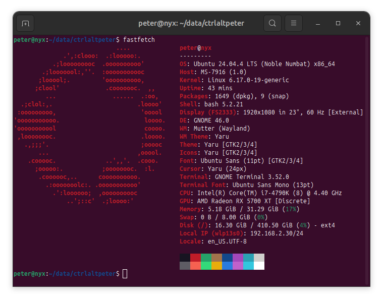

# Ubuntu journey 2026
The object of this section is to document my Ubuntu 24.04.4 LTS journey on a desktop in 2026.
It shows what and how needs to be installed including issues I face along the way.

## Asus PCE-AC68 / broadcom bcm4360
Default broadcom-sta-dkms fails to compile with the latest kernel. Specific version from restricted repository must be installed instead. This version is shipped with Ubuntu 25.10

Inspired by:
  - https://blog.abysm.org/2026/02/fixing-broadcom-sta-dkms-on-ubuntu-noble/
  - https://discourse.ubuntu.com/t/bcm4360-driver-works-on-25-10-but-not-on-24-04-3-lts/76543/9

```
cd /tmp
wget https://archive.ubuntu.com/ubuntu/pool/restricted/b/broadcom-sta/broadcom-sta-dkms_6.30.223.271-23ubuntu1.2_all.deb
sudo apt install ./broadcom-sta-dkms_6.30.223.271-23ubuntu1.2_all.deb
```

## Fastfetch
Links:
  - Homepage: https://github.com/fastfetch-cli/fastfetch
  - Ppa Homepage: https://launchpad.net/~zhangsongcui3371/+archive/ubuntu/fastfetch

```
sudo add-apt-repository ppa:zhangsongcui3371/fastfetch
sudo apt update
sudo apt install fastfetch
```



## Flatpak
Add Flatpak support to Ubuntu.
Source: https://flatpak.org/setup/Ubuntu

```
sudo apt install flatpak gnome-software-plugin-flatpak
flatpak remote-add --if-not-exists flathub https://dl.flathub.org/repo/flathub.flatpakrepo
sudo reboot
```

## Git
Official instructions: https://github.com/git-guides/install-git

```
sudo apt install git-all
```

### Gittyup
Git gui alternative, similar to SourceTree.
Github: https://github.com/Murmele/Gittyup

1. Install [Flatpak](#flatpak)
2. ```
   flatpak install flathub com.github.Murmele.Gittyup
   ```

## Disable OS_PROBER
Disables grub detecting other operating systems. E.g. we're running ubuntu completely isolated and use bios boot menu to choose os.

```
sudo nano /etc/default/grub

# Append to end of file
GRUB_DISABLE_OS_PROBER=true

sudo update-grub
```

## Remove duplicate boot entries in UEFI
After multiple install attemps, I ended up with duplicate entries in UEFI.
Note: Ubuntu installs two bootloaders shim and grubx64. Shim is for Secureboot enabled installs, while grubx64 for normal. In reality shim chainloads grubx64. This is by design. My machine had multiple grubx64 entries poitning to same file.

```
# List entries (and find duplicate, pointing to same file)
sudo efibootmgr -v

# Remove duplicate entry <ID>
sudo efibootmgr -b <ID> -B
```

## KeePassXC
Alternative for awesome password manager [KeePass](https://keepass.info/) - [KeePassXC](https://keepassxc.org/download/#linux)

```
sudo apt install keepassxc
```

## Virtualbox
Inspired by:
  - https://www.virtualbox.org/wiki/Linux_Downloads
  - https://oneuptime.com/blog/post/2026-01-15-install-virtualbox-ubuntu/view
```

# 1. Get key
wget -q https://www.virtualbox.org/download/oracle_vbox_2016.asc -O- | sudo gpg --dearmor -o /usr/share/keyrings/oracle-virtualbox.gpg

# 2. Add ppa and reference the key
echo "deb [arch=amd64 signed-by=/usr/share/keyrings/oracle-virtualbox.gpg] https://download.virtualbox.org/virtualbox/debian $(lsb_release -cs) contrib" | sudo tee /etc/apt/sources.list.d/virtualbox.list

# 3. Search for available releases
sudo apt update
apt-cache search virtualbox-

# 4. Install latest release
sudo apt install virtualbox-7.2
```
