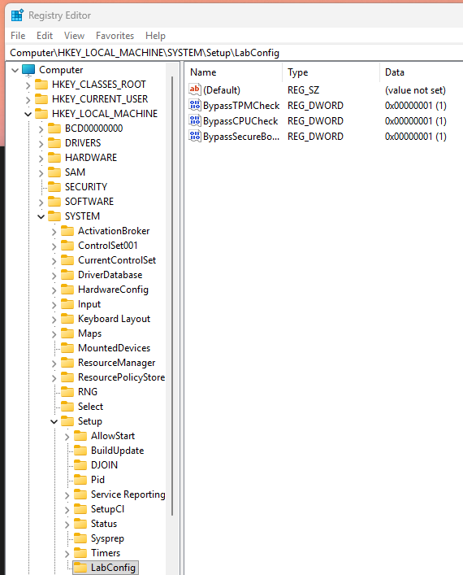

# Windows 11 install tweaks

## Install Windows11 on unsupported hardware

  - Based on your machine, there are essentially three reasons, why your system may be considered "unsupported":
    - lack of TPM chip
    - old CPU
    - secure boot not supported
  - All of those can be workaround by implementing - inserting the appropriate value to registry editor upon installer start (applies to clean install):
    1. Boot the installer as usual
    2. Open terminal `SHIFT + 10`
    3. `regedit`
    4. Navigate to `HKEY_LOCAL_MACHINE/SYSTEM/SETUP`
    5. Create new "Key" (Folder) - `right click Setup -> New -> Key` named `LabConfig`
    6. Create new `DWORD (32-bit) Value` for each of the required workarounds with value of `1` named accordingly:
       1. `Right Click LabConfig -> new -> DWORD (32-bit) Value`, name it accordingly
       2. Double click the value, set `Value data` to `1`
       ```
       BypassTPMCheck
       BypassCPUCheck
       BypassSecureBootCheck
       ```

       
    7. Close regedit
    8. Exit terminal `exit`
    9. Proceed with installation

    

## Install with local account - without microsoft account (Windows11 - pro)

   1. Disconnect your pc from network (unplug RJ45) prior to starting the installation
   2. Once the installer copies all the relevant files, system reboots and you are greeted with screen required you to connect to wifi, open up terminal `SHIFT + F10`
   3. type in `oobe\bypassnro` + ENTER
   4. System reboots and greets you with same screen with additional button `I don't have internet`
   5. Click it and proceed with install

## Note
   - All the tweaks has been tested and proved working with `Win11_25H2_English_x64.iso` downloaded on `2026-03-19`
   - There have been articles mentioning `oobe\bypassnro` no longer effective - which wasn't true for my most recent install. In such case, one might try `start ms-cxh:localonly` instead