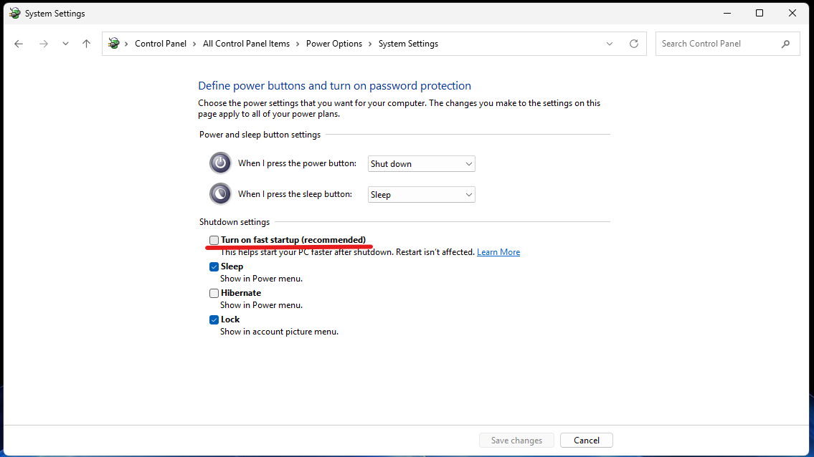
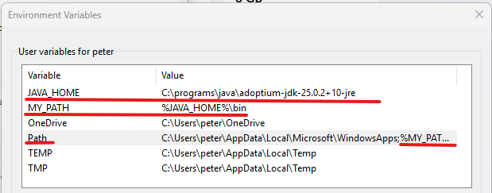

# Windows Tweaks

## Disable Fast Startup

   ### What is (not) the Fast Startup

   Disables Fast Startup, or so called "Hybrid Shutdown" - if you will. It is a feature to allow for faster startups by shutting down programs and "hibernating" the kernel with loaded drivers to the drive. It is defacto a mixture between hibernate and shut down.

   Among with others it:
   - Causes unnecessary writes to the SSD
   - Might cause other issues by not performing the full shutdown / fresh load every boot

   The easiest way to check and spot it is turned on is to:
   1. Open the Task Manager
   2. Performance
   3. CPU
   4. Up Time - You are going to have time much greater then the current session / windows "on time" - hours, sometimes even days.
   
   Please note, that this is a different to **Fast boot** option in bios, which usually skips some checks, boot options, ability to pick boot device or invoke BIOS(UEFI) options.

   ### To disable Fast Startup
   
   1. `WIN+R` (Run)
   2. `control` - opens classic (old school) Control Panel
   3. Power Options
   4. Choose what the power buttons do
   5. Change settings that are currently unavailable
   6. Turn On Fast Startup (Recommended)
   7. Uncheck
   
   8. Save changes
   9. Enjoy the fresh kernel each boot

## Use Screen-Capture tool of your choice - Windows 11

   Since Windows11, the Snipping Tool is the default tool for capturing/marking up screenshots. In order to use screenshot tool of your choice (e.g. [Greenshot](../tools/tools.md#references)), the default - snipping tool listening on **PrtScn** must be disabled.
   
   In order to disable Windows Snipping tool listening on PrtScn:
   
   1. `Win+X` -> `Settings` -> `Accessibility` -> `Keyboard`
   2. `Use The Print screen to open screen capture` -> `Off`
   3. Restart Greenshot / your screen capture tool to register it for PrtScn

## Take Ownership of Files from previous install
Sometimes after a reinstallation files on non-system drive (e.g. D:/ data drive) become read-only due to file permissions issues. These files are still owned by user from previous os/installation. One must take ownership and reset file permissions on these files to become writable again. 

Please use only on single user installations, where the user currently logged in should become owner of the files.

Open Terminal `Start -> run -> cmd -> ctrl+shift+enter (run as admin)`
```
# 1. Take ownership (current user of all folders/files on drive)
takeown /f D:\ /r /d y
 
# 2. Reset permissions for all files/folders - it removes all permissions, but the owner has full access, thus the runner (from 1st step can access them). Note the path in UNC format. icacls would fail on long file names otherwise (>260 chars)
icacls \\?\D:\ /reset /t /c
   
# 3. Previous Commands affected Recycler bin, which is now "corrupted"
#    1. Delete it from affected drive, or
#    2. Answer yes to prompt "Recycler is corrupted, do you want to empty it" popping up whenever an operation on given drive is performed.
```


## After-Installation

### Cleanup
Following apps can be removed, most are not usable without Microsoft Account, or not usable at all.

1. Open Apps, `Win + X -> Settings -> Apps -> Installed Apps`
2. Remove one by one
   - Clipchamp
   - Onedrive
   - Microsoft Todo
   - News
   - Outlook
   - Quick Assist
   - Solitaire & Casual Games
   - Sticky Notes

### Libraries / User folders redirection

Redirect `Downloads/Documents/Pictures/Music/Videos` folders to another drive.
1. `C:\Users\<USER>`
2. `Documents -> Right Click -> Properties -> Location -> Move...`
3. Browse to desired location, e.g. `D:\<USER>\Documents`
4. `Apply -> Yes`
5. Repeat for remaining folders.


### Settings
- Shrink (System) Drive by 10% to allow for SSD Over-provisioning `Win+R -> diskmgmt.msc -> C:\ -> Right Click -> Shrink Volume... -> Enter the amount to shrink in MB -> 0,1 x 1024 x Drive Size`
- Adjust Drive Letters `Win+R -> diskmgmt.msc -> C:\ -> Right Click -> Change Drive Letter and Paths -> Change -> pick New Letter`
- Sleep Settings - Screen 5min / Sleep Never
- Hide Search, Widgets on Taskbar
- [Disable Fast Startup](#disable-fast-startup)
- Install Language + Keyboard
- Explorer Options
  - `Open Explorer -> 3 dots -> Options`
    - General:
      - Open File Explorer To: This PC
    - View
      - Hidden files and folders -> Show hidden files, folders, and drives
      - Hide extensions for known file types: uncheck
- Small Desktop Icons `Desktop -> Right Click -> View -> Small Icons`
- DNS
  - `Win + R -> control -> Network and Sharing Center -> Change adapter settings -> Ethernet/Wi-Fi -> Right Click -> Internet Protocol Version 4 (TCP/IPv4) -> Use the following DNS server addresses: -> point to local adguardhome/pi-hole`

### Install / Useful Apps

List of useful apps:
- 7-zip
  - Download: https://www.7-zip.org/
- Corz-Checksum
  - Download: https://corz.org/windows/software/checksum/
  - Config/key: `D:\install\corz_checksum`
    - Make sure, that config structure hasn't changed, e.g. using WinMerge - comparing customized with latest default version
- Firefox
  - Download: https://www.firefox.com/en-US/download/all/desktop-release/
  - Extensions:
    - Ublock Origin:
      - https://addons.mozilla.org/en-US/firefox/addon/ublock-origin/
      - Options -> Filter lists -> Regions -> enable `cz | sk: EasyList Czech and Slovak` -> Apply Changes
    - Firefox Multi Account Containers: https://addons.mozilla.org/en-US/firefox/addon/multi-account-containers/
  - Default Search Engine: DuckDuckGo
  - Homepage and new Windows / New Tabs: Blank Page
  - Save files to: <FOLDER>
  - Always ask you where to save files: check
  - Disable Data Collection and Use
    - `3 lines (Burger Menu) -> Settings -> Privacy & Security -> Firefox Data Collection and Use -> Uncheck All`
- Foobar2000
  - Download: https://www.foobar2000.org/
- FreeFileSync
  - Backup/File Synchronization tool for Windows
  - Download: https://freefilesync.org/
- Adoptium OpenJDK/JRE
  1.  Download: https://adoptium.net/
  2. `Latest Releases -> JDK25 - LTS -> Windows -> JDK/JRE -> .ZIP -> Download`
  3. Unpack to, e.g. `C:\programs\java\adoptium-jdk-25.0.2+10-jre`
  4. Add it to path / set as default java
     1. `Win+X -> Settings -> System -> About -> Advanced system settings -> Environment Variables`
     2. Create `JAVA_HOME` **user** variable and point it to jre **root** directory, not bin => path from step 3.
     3. Create `MY_PATH` user variable, which is going to contain all user added paths, so it doesn't mix up with and clutter default / path modified by system installers. Add `%JAVA_HOME%/bin`
     4. Edit `Path` user variable and add `%MY_PATH%` to the end.
     5. 
5. Verify, that it's working
   1. `Win + R -> cmd -> java -version`
- Git
  - Download: https://git-scm.com/
- KeePass
  - Download: https://keepass.info/index.html
- Notepad++
  - Download: https://notepad-plus-plus.org/downloads/
- PortfolioPerformance
  - Download: https://www.portfolio-performance.info/en/
- Sumatra PDF
  - Lightweight PDF viewer for Windows
  - Download: https://www.sumatrapdfreader.org/free-pdf-reader
  - Install:
    1. run `64-bit install exe`
    2. Options -> Install for all users
    3. Install SumatraPDF
- VSCodium
  - Download: https://vscodium.com/
  - Gruvbox Theme
    - Extensions `CTRL+Shift+X` -> Gruvbox Theme (jdinhlife.gruvbox) -> Install -> - Gruvbox Dark Hard
- Thunderbird
  - Download: https://www.thunderbird.net/en-US/
  - Add existing Profile:
    1. `WIN + R -> cmd`
    2. `cd "C:\Program Files\Mozilla Thunderbird"`
    3. Create Profile
    4. Enter some name, e.g. `my-profile`
    5. `Choose Folder -> Navigate to Your Folder -> D:\peter\Documents\Thunderbird Profiles\abcdefg1.my-profile`
    6. Mark `default-release`, `default` -> Delete Profile -> Delete Files
    7. Exit
    8. Restart Thunderbird
  - Run At Startup
    1. `WIN + R -> shell:startup`
    2. Copy Thunderbird shortcut from desktop to the folder opened by previous command, e.g. `C:\Users\peter\AppData\Roaming\Microsoft\Windows\Start Menu\Programs\Startup`
    3. In case there are multiple profiles for Thunderbird and one wishes to open that one, append `-P "my-profile"` to the **Target** (`Right Click on Shortcut -> Properties -> Target`)
    4. Example: `"C:\Program Files\Mozilla Thunderbird\thunderbird.exe" -p "my-profile"`
- WinMerge
  - Diff tool for Windows
  - https://winmerge.org/?lang=en

## Before Windows Reinstallation

List of apps/folders/settings worth to backup before reinstallation, based on my personal experience (important to me):

- `c:/programs` - Non-install / portable / extract-only apps. Settings are often kept within their folders, thus it makes sense to back them up.
- Firefox Bookmarks